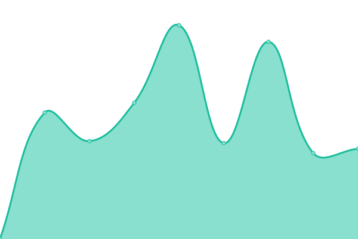
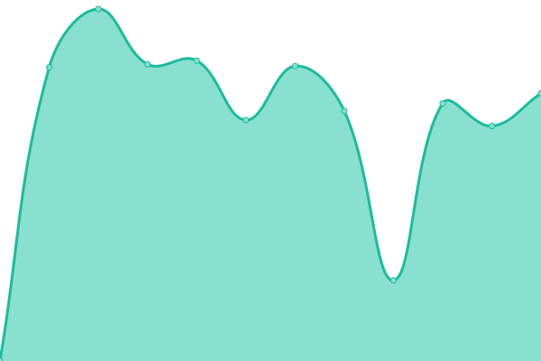

# [📈 Live Status](https://lobner.github.io/status): <!--live status--> **🟧 Partial outage**

This repository contains the open-source uptime monitor and status page for [Søren Løbner](www.bdq.dk), powered by [Upptime](https://github.com/upptime/upptime).

With [Upptime](https://upptime.js.org), you can get your own unlimited and free uptime monitor and status page, powered entirely by a GitHub repository. We use [Issues](https://github.com/lobner/status/issues) as incident reports, [Actions](https://github.com/lobner/status/actions) as uptime monitors, and [Pages](https://lobner.github.io/status) for the status page.

<!--start: status pages-->
<!-- This summary is generated by Upptime (https://github.com/upptime/upptime) -->
<!-- Do not edit this manually, your changes will be overwritten -->
<!-- prettier-ignore -->
| URL | Status | History | Response Time | Uptime |
| --- | ------ | ------- | ------------- | ------ |
|  [Løbner.dk](https://www.løbner.dk) | 🟥 Down | [lobner-dk.yml](https://github.com/lobner/status/commits/HEAD/history/lobner-dk.yml) | 

 572ms
     
 | 

<a href="https://lobner.github.io/status/history/lobner-dk">98.70%</a>
    

|  [IP @ lobner.dk](https://ip.lobner.dk) | 🟥 Down | [ip-lobner-dk.yml](https://github.com/lobner/status/commits/HEAD/history/ip-lobner-dk.yml) | 

 657ms
     
 | 

<a href="https://lobner.github.io/status/history/ip-lobner-dk">98.72%</a>
    

|  [BiQ Insight](https://insight.biq.dk) | 🟩 Up | [bi-q-insight.yml](https://github.com/lobner/status/commits/HEAD/history/bi-q-insight.yml) | 

 5124ms
     
 | 

<a href="https://lobner.github.io/status/history/bi-q-insight">100.00%</a>
    

|  [BiQ Insight (data)](https://data.biq.dk) | 🟩 Up | [bi-q-insight-data.yml](https://github.com/lobner/status/commits/HEAD/history/bi-q-insight-data.yml) | 

 592ms
     
 | 

<a href="https://lobner.github.io/status/history/bi-q-insight-data">100.00%</a>
    

|  [BiQ Compliance](https://compliance.biq.dk) | 🟩 Up | [bi-q-compliance.yml](https://github.com/lobner/status/commits/HEAD/history/bi-q-compliance.yml) | 

 1388ms
     
 | 

<a href="https://lobner.github.io/status/history/bi-q-compliance">100.00%</a>
    

|  [BiQ A/S](https://www.biq.dk) | 🟩 Up | [bi-q-a-s.yml](https://github.com/lobner/status/commits/HEAD/history/bi-q-a-s.yml) | 

 1519ms
     
 | 

<a href="https://lobner.github.io/status/history/bi-q-a-s">100.00%</a>
    

<!--end: status pages-->

[**Visit our status website →**](https://lobner.github.io/status)

## 📄 License

- Powered by: [Upptime](https://github.com/upptime/upptime)
- Code: [MIT](./LICENSE) © [Søren Løbner](https://www.biq.dk)
- Data in the `./history` directory: [Open Database License](https://opendatacommons.org/licenses/odbl/1-0/)
